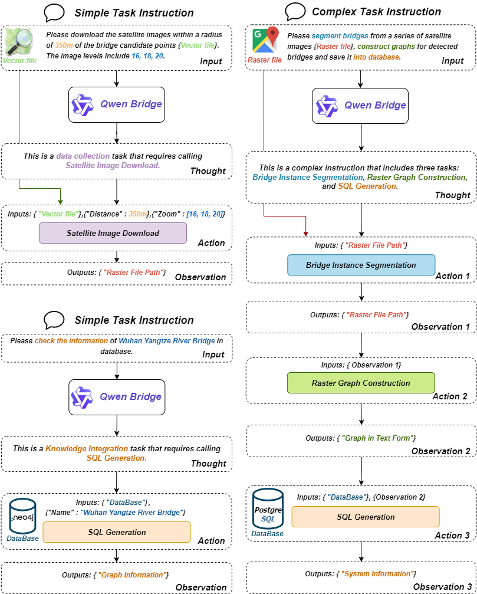

# 🚀 LLM-Driven Multimodal Knowledge Graph Construction for Bridges

    IGRASS 2025 (Under Review)

 

A framework that integrates Large Language Models (LLMs) with AI-powered tools to construct multimodal knowledge graphs for bridge infrastructure.

    

## 📌 Overview
Bridges are critical infrastructure in transportation networks. Traditional knowledge graphs (KGs) rely on text-based information, but bridge monitoring requires multimodal data, including:
- **Vector data** (structural and spatial relations)
- **Raster data** (real-time satellite imagery)
- **Text data** (metadata, descriptions)

Bridge-MMKG-Agent addresses this by integrating LLMs and a specialized AI toolkit for seamless multimodal knowledge graph construction.

## 🔧 Features
- **LLM-Driven Agent**: Utilizes a fine-tuned Qwen-Bridge model for task automation.
- **Multimodal Data Processing**: Supports text, vector, and raster data.
- **Automated KG Construction**: Includes entity extraction, data integration, and real-time knowledge updates.
- **Natural Language Interaction**: Users can interact with the system using simple natural language queries.
## 🛠️ System Architecture

**Bridge-MMKG-Agent** adopts an **LLM (Qwen-Bridge) + AI Toolkit** approach to construct multimodal knowledge graphs for bridges. The system consists of the following core components:

---

### 1️⃣ Core Driver (Qwen-Bridge)
🔹 **Role**: Task Planning + Tool Invocation  
🔹 **Base Model**: Qwen2.5-7B-Instruct (fine-tuned with GPT-4o-generated high-quality data)  
🔹 **Execution Logic**:
- **Thought Phase**: Analyzes user instructions, decomposes tasks, and selects the appropriate tools.
- **Action Phase**: Invokes the necessary tools based on the task breakdown, ensuring correct parameter handling.

---

### 2️⃣ Dynamic Task Workflow
The system follows a **Thought-Action-Observation** paradigm, allowing it to decompose and execute tasks logically:

- **Simple Tasks** (e.g., downloading satellite images, querying bridge data): Direct tool invocation.
- **Complex Tasks** (e.g., bridge segmentation, knowledge graph construction): Decomposed into multiple subtasks, dynamically managing tool execution for data flow and correctness.

    

---

### 🛠️ Multimodal Knowledge Graph Construction Toolkit
**Bridge-MMKG-Agent** consists of **four core toolkits**, each handling different stages of data processing.

| **Tools**                          | **Modality** | **Method**        |
|------------------------------------|-------------|------------------|
| Satellite Image Download¹         | Raster      | Google API       |
| Textual Content Download¹         | Text        | Baidu Baike API  |
| Geographic Information Retrieval¹  | Vector      | Baidu Map API    |
| Bridge Points Extraction²          | Vector      | Arcpy Scripts    |
| Bridge Instance Segmentation²      | Raster      | **SAM-Bridge⁵**  |
| Bridge Information Extraction²     | Text        | **Qwen-Bridge⁶** |
| Vector Graph Integration³          | Vector      | Arcpy Scripts    |
| Raster Graph Integration³          | Raster      | GDAL Scripts     |
| Graph Connection³                  | All        | Python Scripts   |
| SQL Generation⁴                    | Text        | **Qwen-Bridge⁶** |

¹ *Tools of data collection* ² *Tools of entity extraction*  
³ *Tools of graph construction*  ⁴ *Tools of knowledge integration*  
⁵ *A fine-tuned version of SAM for **Prompt-free Bridge Segmentation**.*  
⁶ *A fine-tuned version of Qwen2.5 as core driver.*  

📌 **System Tool Architecture**:  
To be continued...

---

## 📊 Experiments & Model Performance

### 🔬 **Qwen-Bridge Model Performance**
We evaluated the **task planning and tool invocation accuracy** of different models using a dataset containing **1,000 training samples** and **180 test samples** (120 simple tasks, 60 complex tasks).

| **Tools**         | **LLaMA3¹** | **GLM4²** | **Qwen2.5³** |
|------------------|------------|------------|------------|
| **Overall Correctness** | 61.1% | 79.4% | **83.3%** |
| **Data Collection** | 77.8% | **88.9%** | 86.1% |
| **Entity Extraction** | 66.7% | 83.3% | **88.9%** |
| **Graph Construction** | 69.4% | **86.1%** | 80.6% |
| **Knowledge Integration** | 41.7% | 58.3% | **83.3%** |
| **Complex Tasks** | 46.7% | 71.7% | **80.0%** |

¹ *LLaMA-3-8B-Instruct*  ² *GLM-4-9B-Chat* ³ *Qwen2.5-7B-Instruct*

📌 **Qwen-Bridge outperforms other models, particularly in handling complex tasks and integrating multimodal knowledge graphs.**

---

### 🛰️ **SAM-Bridge Model for Bridge Segmentation**
To improve **automated bridge segmentation**, we fine-tuned the **SAM (Segment Anything Model)** using **6,000 bridge instance images** from the **SAMRS dataset**.  
- Achieved **mAP@50 (Mean Average Precision) of 56.81%** and an **IoU of 38.35%**.
- Only **7.3% lower than SOTA** results for bridge segmentation.

📌 **SAM-Bridge provides effective segmentation with minimal fine-tuning effort, optimizing cost and performance.**

---

## 🚀 Case Study: Bridge-MMKG-Agent in China
### 📊 Data Processing Overview:
- **Identified 72,000+ bridge locations** by overlaying OSM road and river layers.
- **Extracted 4,800+ Baidu Baike entries** as textual bridge descriptions.
- **Downloaded 240,000+ satellite images** (Zoom levels 14-20).
- **Constructed a multimodal knowledge graph with 100,000+ bridge entities**.

📌 **Visualization of Case Study**:  
To be continued...

---

## 🔚 Conclusion
Bridge-MMKG-Agent, with its **LLM-powered multimodal knowledge graph construction**, achieves:
✅ **Automated bridge knowledge graph generation**  
✅ **Efficient LLM-driven task decomposition and tool execution**  
✅ **AI-powered geospatial data solutions**  

Looking ahead, **this system has potential applications in global bridge monitoring, automated data management, and disaster response**. 🚀

